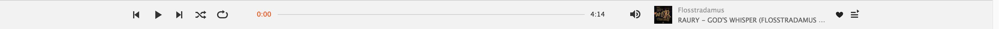

### 오늘의 todo

1. 구조 나누기 

header 

Presto

Artist/Genre/Album

뷰 라이프 사이클 적용하기 ! 

1. 체크리스트 ㅇㅅㅇ
next/ prev 될 떄 상태 play알아서 play상태로 되도록 하기 [O]

2. 라이프 사이클 적용해서 next or prev된 후에 
title이랑 set 
load가 된 후에 play?

3. 프로그레스바 

currentTiem update -> ProgressBar Animation 
and 
ProgressBar drag and drop적용하기
